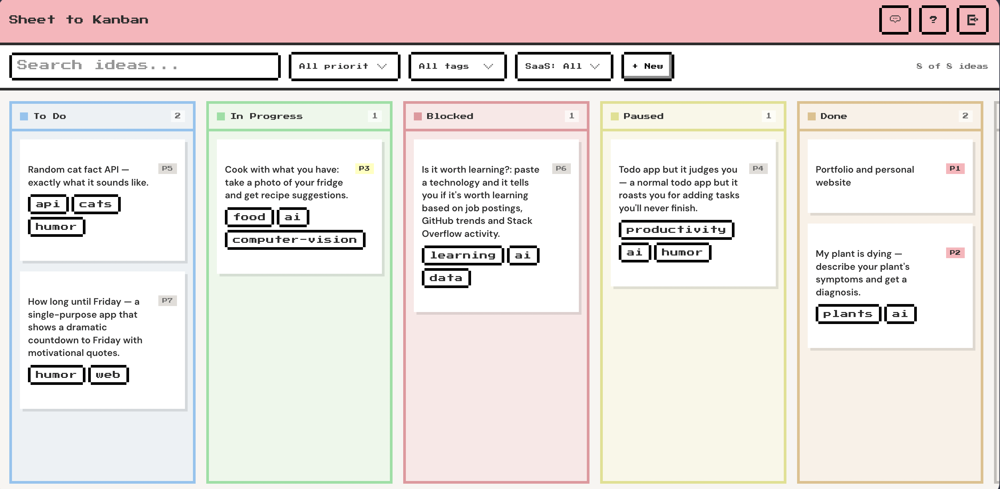
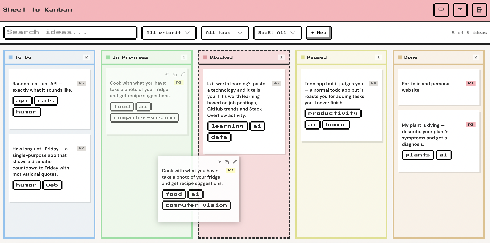
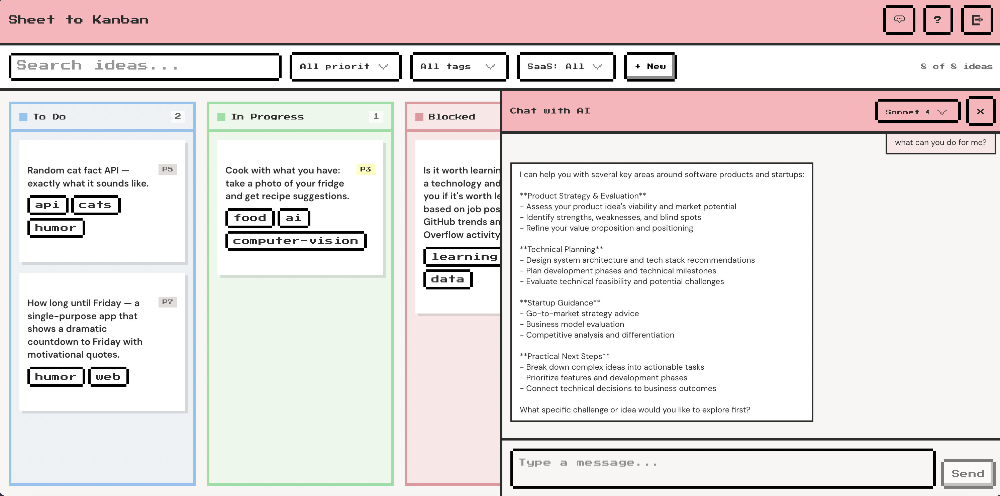
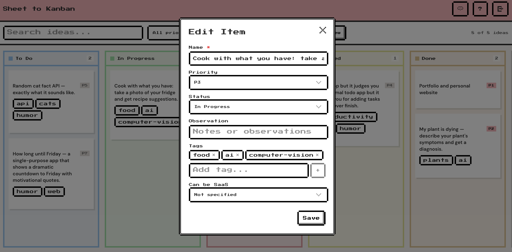

# Sheet to Kanban

A pixel-art themed Kanban board that uses Google Sheets as its backend, with an integrated AI chat panel powered by Claude for product ideation and refinement.

<!-- Replace with a screenshot of the full board -->


---

## Demo

<!-- Replace with a GIF or video link showcasing drag-and-drop, filtering, and AI chat -->
> **Video placeholder** — Add a screen recording or GIF here showing the app in action.

---

## Features

**Kanban Board**
- Drag-and-drop cards across columns: To Do, In Progress, Blocked, Paused, Done, Won't Do
- Auto-saves status changes back to your Google Sheet in real time
- Priority badges, tags, and SaaS indicators on each card

<!-- Replace with a screenshot of a card being dragged between columns -->


**AI Chat Panel**
- Integrated Claude AI assistant for refining product ideas
- "Build with AI" button on any card generates a structured prompt
- Resizable split-pane layout — work on your board and chat side by side
- Supports Claude Sonnet and Opus models

<!-- Replace with a screenshot of the chat panel open alongside the board -->


**Filtering & Search**
- Filter cards by search text, priority level, tags, or SaaS potential
- Real-time filtering with card count

**Pixel-Art UI**
- Custom `pixelact-ui` component library with retro aesthetic
- Pixel fonts, chunky borders, and pastel color-coded columns

<!-- Replace with a close-up screenshot of a few cards showing the pixel art style -->


---

## Architecture

```
┌─────────────┐       ┌─────────────────┐       ┌──────────────┐
│   React UI  │──────>│  Backend API    │──────>│ Google Sheet  │
│  (Vite/TS)  │<──────│  (REST)         │<──────│ (Data Store)  │
└──────┬──────┘       └─────────────────┘       └──────────────┘
       │
       │  Claude API
       v
┌─────────────┐
│  Anthropic  │
│  Messages   │
└─────────────┘
```

The frontend reads and writes cards through a backend API that wraps Google Sheets. The AI chat panel communicates directly with the Anthropic API from the browser.

---

## Tech Stack

| Layer       | Technology                                      |
|-------------|--------------------------------------------------|
| Framework   | React 19 + TypeScript                            |
| Build       | Vite 8                                           |
| Styling     | Tailwind CSS 4 + SCSS                            |
| Components  | Radix UI + custom pixel-art component library    |
| AI          | Claude API (Anthropic)                           |
| Layout      | react-resizable-panels                           |
| Data        | Google Sheets (via backend REST API)             |

---

## Getting Started

### Prerequisites

- Node.js 18+
- A backend API that wraps Google Sheets (endpoints: `/getSheet`, `/updateCell`, `/addRow`, `/updateRow`)
- An Anthropic API key (for the AI chat feature)

### Installation

```bash
git clone https://github.com/monik182/sheet-to-kanban.git
cd sheet-to-kanban
npm install
```

### Environment Variables

Create a `.env` file in the project root:

```env
VITE_API_URL=https://your-backend-api-url.com
```

The Anthropic API key is entered through the login screen at runtime (not stored in env).

### Run

```bash
npm run dev
```

Open [http://localhost:5173](http://localhost:5173) in your browser.

---

## Google Sheet Format

Your Google Sheet should have these columns:

| Priority | Name | Status | Observation | Tags | Can be SaaS |
|----------|------|--------|-------------|------|-------------|
| 1        | My App Idea | To Do | Notes here | tag1, tag2 | Yes |

---

## Screenshots

| Board Overview | AI Chat | Card Detail |
|:-:|:-:|:-:|
|  |  |  |

---
